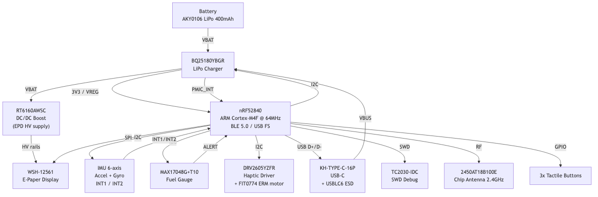

# InkTime

---

## Block Diagram



---

## Bill of Materials (BOM)

| Ref   | Component         | Description                                        | Package   | JLCPCB Part                                                                        | Datasheet                                                                                    |
| ----- | ----------------- | -------------------------------------------------- | --------- | ---------------------------------------------------------------------------------- | -------------------------------------------------------------------------------------------- |
| U1    | nRF52840-QIAA     | MCU, BLE 5.0, ARM Cortex-M4F, 1MB Flash, 256KB RAM | QFN-73    | [C190794](https://jlcpcb.com/partdetail/NordicSemiconductor-nRF52840_QIAA/C190794) | [Datasheet](https://infocenter.nordicsemi.com/pdf/nRF52840_PS_v1.1.pdf)                      |
| U2    | BQ25180YBGR       | LiPo charger, I2C, 1A, integrated power path       | DSBGA-9   | [C2678722](https://jlcpcb.com/partdetail/TexasInstruments-BQ25180YBGR/C2678722)    | [Datasheet](https://www.ti.com/lit/ds/symlink/bq25180.pdf)                                   |
| U3    | MAX17048G+T10     | Fuel gauge, 1% SOC accuracy, I2C                   | SOT-23-6  | [C82344](https://jlcpcb.com/partdetail/MaximIntegrated-MAX17048GT10/C82344)        | [Datasheet](https://datasheets.maximintegrated.com/en/ds/MAX17048-MAX17049.pdf)              |
| U4    | RT6160AWSC        | DC/DC boost converter for EPD supply               | SOT-23-6  | Search RT6160AWSC                                                                  | [Datasheet](https://www.richtek.com/assets/product_file/RT6160A/DS6160A-02.pdf)              |
| U5    | DRV2605YZFR       | Haptic driver, I2C, LRA/ERM support                | DSBGA-16  | [C2062186](https://jlcpcb.com/partdetail/TexasInstruments-DRV2605YZFR/C2062186)    | [Datasheet](https://www.ti.com/lit/ds/symlink/drv2605.pdf)                                   |
| IC1   | IMU (6-axis)      | 3-axis accelerometer + 3-axis gyroscope, I2C       | -         | See schematic                                                                      | -                                                                                            |
| IC2   | USBLC6-2SC6Y      | USB ESD protection                                 | SOT-363   | [C2827654](https://jlcpcb.com/partdetail/STMicroelectronics-USBLC62SC6Y/C2827654)  | [Datasheet](https://www.st.com/resource/en/datasheet/usblc6-2.pdf)                           |
| J1    | KH-TYPE-C-16P     | USB-C connector, 16-pin                            | SMD       | Search KH-TYPE-C-16P                                                               | -                                                                                            |
| J2    | TC2030-IDC        | Tag-Connect SWD debug connector, 10-pin            | THT       | -                                                                                  | [Datasheet](https://www.tag-connect.com/wp-content/uploads/bsk-pdf-manager/TC2030-IDC_1.pdf) |
| ANT1  | 2450AT18B100E     | 2.4 GHz chip antenna, 50 Ω                         | SMD       | Search 2450AT18B100E                                                               | [Datasheet](https://www.johansontechnology.com/datasheets/antennas/2450AT18B100E.pdf)        |
| L1    | FTC252012SR47MBCA | Power inductor 4.7 µH                              | 1008      | Search FTC252012SR47M                                                              | -                                                                                            |
| M1    | DFRobot FIT0774   | ERM haptic motor (shaker)                          | -         | -                                                                                  | [Datasheet](https://www.dfrobot.com/product-1784.html)                                       |
| BAT1  | AKY0106           | LiPo battery 400 mAh, 3.7V                         | -         | -                                                                                  | [Datasheet](https://www.tme.eu/Document/b9e12bf26ad0ba929a22ab5d58f022cd/AKY0106.pdf)        |
| DSP1  | WSH-12561         | E-paper display, SPI interface                     | -         | -                                                                                  | [Datasheet](https://www.tme.eu/Document/0ca57a8ffbcd57b5bca53252eb9d6ec3/WSH-12561.pdf)      |
| R1–Rn | Various           | Resistors 0201, values per schematic               | 0201      | -                                                                                  | -                                                                                            |
| C1–Cn | Various           | Capacitors 0201 (≤100nF), 0402 (>100nF)            | 0201/0402 | -                                                                                  | -                                                                                            |

---

## Hardware Description

### MCU - nRF52840

The nRF52840 is the central processing unit of InkTime. It integrates:

- **ARM Cortex-M4F** at 64 MHz with FPU
- **BLE 5.0** (used for time sync, notifications)
- **USB 2.0 Full Speed** (charging detection and firmware updates)
- **1 MB Flash / 256 KB RAM**

All peripherals are connected directly to the nRF52840 via SPI (e-paper display) and I2C (IMU, fuel gauge, haptic driver, PMIC).

### Power Path

```
USB-C --> BQ25180 (charger) --> LiPo battery (AKY0106, 400 mAh)
                            --> 3.3V rail (VREG, for MCU and all peripherals)
Battery --> RT6160AWSC (boost) --> EPD high-voltage supply (VCOM, gate voltages)
```

- **BQ25180YBGR** manages LiPo charging at up to 1A, monitors VBUS, and raises `PMIC_INT` for fault/status events. Communicates with the MCU over I2C.
- **RT6160AWSC** is a boost converter that generates the higher voltages needed by the e-paper display driver (PREVGH, PREVGL, etc.).
- **MAX17048G+T10** is a ModelGauge fuel gauge that estimates battery state-of-charge (SOC) with 1% accuracy over I2C, using a single-cell LiPo model.

### E-Paper Display - WSH-12561

The e-paper display connects to the MCU over **SPI** plus 3 control GPIOs:

| Signal   | Direction | Description                 |
| -------- | --------- | --------------------------- |
| SCK      | MCU → EPD | SPI clock                   |
| MOSI     | MCU → EPD | SPI data                    |
| EPD_CS   | MCU → EPD | Chip select (active low)    |
| EPD_DC   | MCU → EPD | Data / Command select       |
| EPD_RST  | MCU → EPD | Hardware reset (active low) |
| EPD_BUSY | EPD → MCU | Busy flag (MCU must wait)   |

The EPD drive circuit (biased by RT6160AWSC) generates the voltages PREVGH, PREVGL, PREVGL, GDR necessary to drive the e-paper panel.

### IMU

6-axis inertial measurement unit connected via **I2C** at 400 kHz. Provides:

- 3-axis accelerometer (step counting, gesture detection, orientation)
- 3-axis gyroscope (motion tracking)
- Two interrupt lines (`IMU_INT1`, `IMU_INT2`) for wake-on-motion and data-ready events

### Haptic Feedback - DRV2605 + FIT0774

The DRV2605YZFR haptic driver controls the FIT0774 ERM motor. It connects to the MCU over **I2C** and has a digital enable signal `HAPTIC_EN`. It supports library-based waveform playback (124 built-in effects).

### USB - KH-TYPE-C-16P + USBLC6-2SC6Y

USB-C connector with USBLC6-2SC6Y ESD protection on D+ and D− lines. The MCU detects VBUS presence via a GPIO for charging control handoff. USB D+ / D− connect directly to the nRF52840's USB transceiver.

### Antenna - 2450AT18B100E

2.4 GHz chip antenna placed at the PCB edge, away from metal and ground planes. The PCB is **cutout under the antenna** - no copper pours or signal traces are routed under the antenna keepout area. Impedance matching network (L + C pi filter) is present between the nRF52840 RF pin and the antenna.

### SWD Debug - TC2030-IDC

Tag-Connect TC2030-IDC footprint for in-circuit programming and debugging (no connector needed, uses spring-loaded probe). Test pads TP_SWDIO, TP_SWDCLK, TP_RESET, TP_3.3V, TP_GND are exposed on the PCB silkscreen.

---

## nRF52840 Pin Assignment

| Pin         | Net         | Connected To                    | Interface  | Notes                                 |
| ----------- | ----------- | ------------------------------- | ---------- | ------------------------------------- |
| P0.00       | XL1         | 32.768 kHz crystal              | LFXO       | Low-frequency clock                   |
| P0.01       | XL2         | 32.768 kHz crystal              | LFXO       | Low-frequency clock                   |
| P0.09       | RF          | Antenna matching network → ANT1 | RF         | Dedicated RF pin, PCB cutout required |
| P0.13       | BTN1        | Button 1 (tactile switch)       | GPIO       | Active low, internal pull-up          |
| P0.14       | BTN2        | Button 2 (tactile switch)       | GPIO       | Active low, internal pull-up          |
| P0.26       | BTN3 / GPIO | Button 3 or peripheral GPIO     | GPIO       | Active low                            |
| P0.27       | GPIO        | -                               | GPIO       | -                                     |
| SDA (P0.xx) | SDA         | IMU, MAX17048, BQ25180, DRV2605 | I2C        | Shared I2C bus, 4.7 kΩ pull-up to 3V3 |
| SCL (P0.xx) | SCL         | IMU, MAX17048, BQ25180, DRV2605 | I2C        | Shared I2C bus, 4.7 kΩ pull-up to 3V3 |
| P1.xx       | SCK         | E-paper display                 | SPI        |                                       |
| P1.xx       | MOSI        | E-paper display                 | SPI        |                                       |
| P1.xx       | EPD_CS      | E-paper display chip select     | GPIO       | Active low                            |
| P1.xx       | EPD_DC      | E-paper data/command            | GPIO       | High = data, Low = command            |
| P1.xx       | EPD_RST     | E-paper reset                   | GPIO       | Active low                            |
| P1.xx       | EPD_BUSY    | E-paper busy                    | GPIO input | Poll or interrupt                     |
| P1.xx       | HAPTIC_EN   | DRV2605 enable                  | GPIO       | Active high                           |
| P1.xx       | PMIC_INT    | BQ25180 interrupt               | GPIO input | Active low                            |
| P1.xx       | IMU_INT1    | IMU interrupt 1                 | GPIO input | Wake-on-motion                        |
| P1.xx       | IMU_INT2    | IMU interrupt 2                 | GPIO input | Data ready                            |
| P1.xx       | ALERT       | MAX17048 alert                  | GPIO input | Low battery threshold                 |
| SWDIO       | SWDIO       | TC2030 pin 2 / TP_SWDIO         | SWD        | Programming & debug                   |
| SWDCLK      | SWDCLK      | TC2030 pin 4 / TP_SWDCLK        | SWD        | Programming & debug                   |
| D+          | D+          | USB-C D+ (via ESD)              | USB        | Full-speed USB                        |
| D−          | D−          | USB-C D− (via ESD)              | USB        | Full-speed USB                        |
| VBUS        | VBUS        | USB-C VBUS detect               | GPIO input | 5V → voltage divider                  |

---

## Power Consumption Estimates

| State                                    | Components active | Estimated current   |
| ---------------------------------------- | ----------------- | ------------------- |
| Deep sleep                               | nRF52840 RTC only | ~3 µA               |
| BLE advertising                          | MCU + BLE radio   | ~3 mA avg           |
| E-paper refresh                          | MCU + EPD + boost | ~30 mA peak (1–2 s) |
| IMU active                               | MCU + IMU         | ~1.5 mA             |
| Full operation (BLE + EPD refresh + IMU) | All               | ~35 mA peak         |

Battery life estimate (400 mAh, mostly in BLE-advertising + sleep mode)
